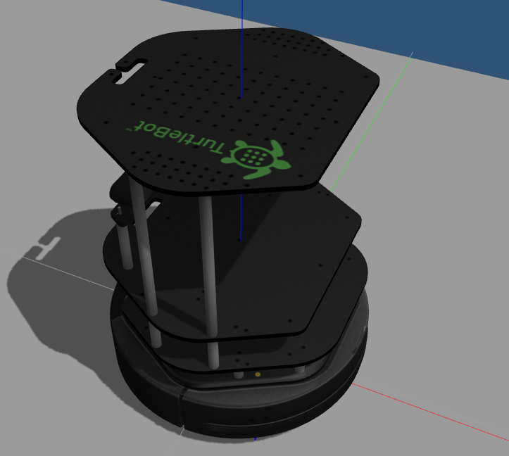
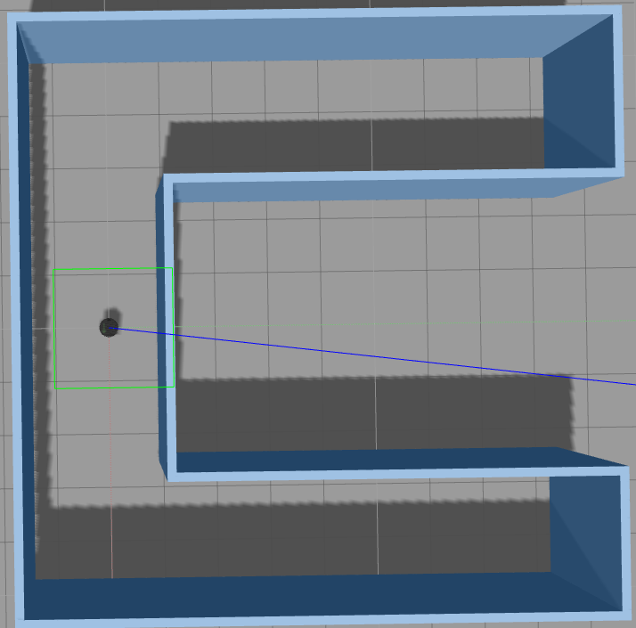
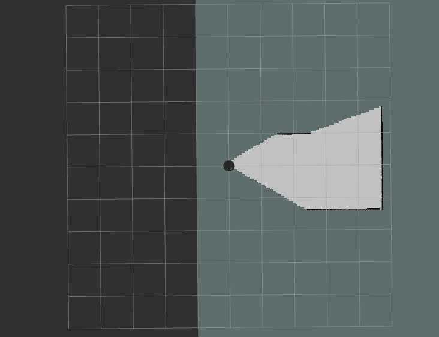
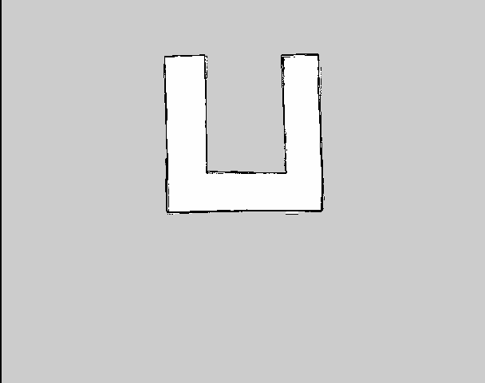
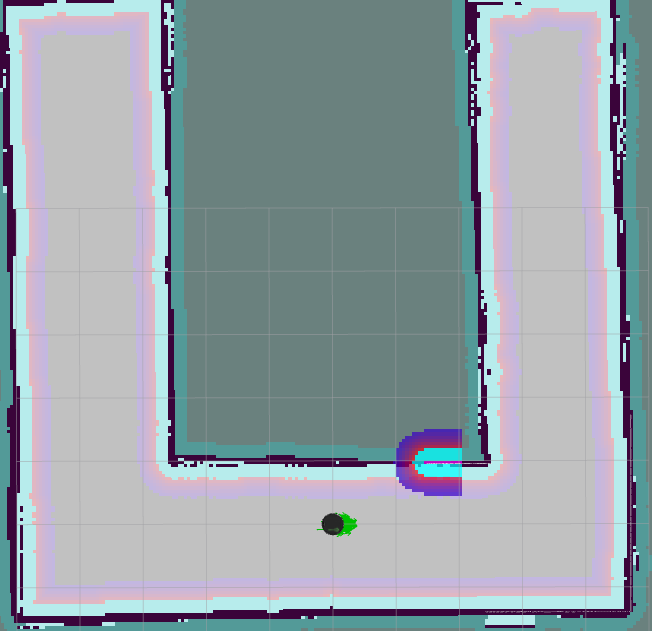
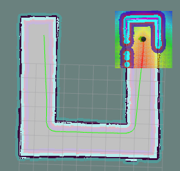
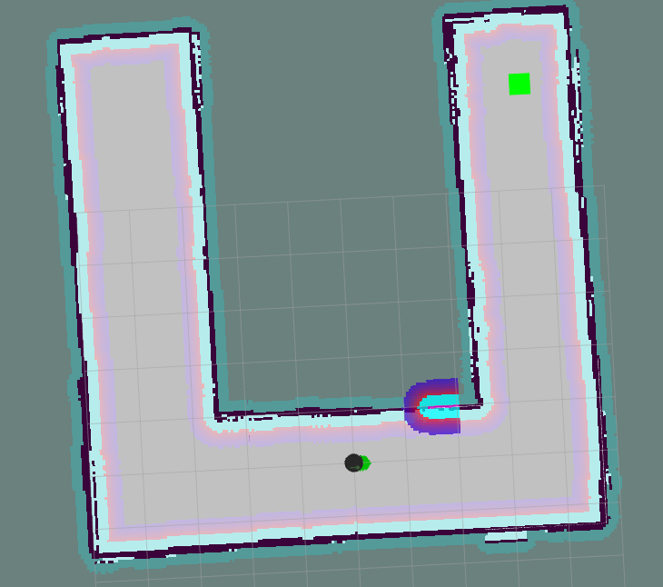
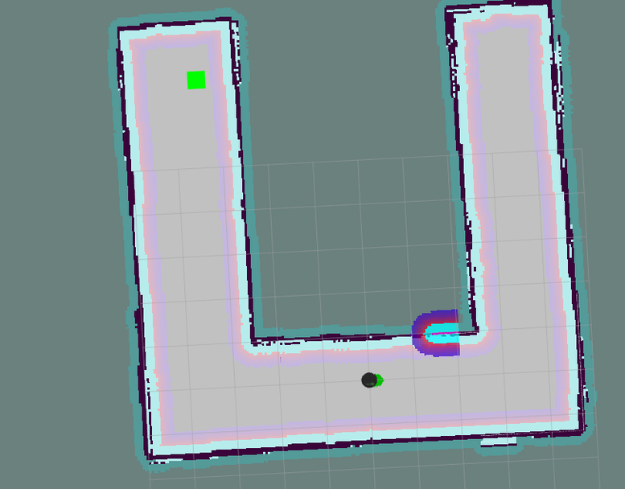

[](https://www.udacity.com/robotics)

# rse_p7_udacity

## Overview
The goal of this project is to build a `Home Service Robot` in ROS (Robot Operating System). To achieve this goal, a Turtlebot is deployed in a previously unknown custom Gazebo World. The Turlebot will use SLAM algorithm to create a Map of the world, use the generated Occupancy Grid Map for Localization and Path Planning, to perform a Pick and Place action. 

## Introduction
For any autonomous mobile robot the ability to map the environment, localize itself within the environment, and navigate through the environment is important. 
This project uses the [Turtlebot Stack](https://github.com/turtlebot/turtlebot) that provides all the basic drivers for running and using a TurtleBot with ROS. The Turtlebot is launched in a custom Gazebo World previously not known to the robot. The Turlebot uses [GMapping Software Package](https://github.com/turtlebot/turtlebot_apps) which provides laser-based SLAM (Simultaneous Localization and Mapping) to create 2-D occupancy grid map. The localization of the Turtlebot is done by [AMCL Package](http://wiki.ros.org/amcl) which uses Adaptive Monte Carlo Localization method; while the Path Planning is based on the [Dijkstra's](https://en.wikipedia.org/wiki/Dijkstra%27s_algorithm), a variant of the [Uniform Cost Search algorithm](https://math.wikia.org/wiki/Uniform_cost_search), to plan our robot trajectory from start to goal position. The [ROS navigation stack](https://github.com/ros-planning/navigation/tree/kinetic-devel) permits your robot to avoid any obstacle on its path by re-planning a new trajectory once your robot encounters them. Further, [turtlebot_viz stack](https://github.com/turtlebot/turtlebot_viz) is used to support user side interactions with the Turtlebot, used for RViz simulation, and a virtual object (Marker) is added in Rviz to visualize Pick and Drop action.

## Directory Structure

                                    ├── add_markers                   # added virtual object node         
                                    │   ├── CMakeLists.txt
                                    │   ├── include
                                    │   │   └── add_markers
                                    │   ├── package.xml
                                    │   └── src
                                    │       ├── add_markers.cpp
                                    │       └── test_addmarkers.cpp
                                    ├── LICENSE
                                    ├── MISC                           # images
                                    │   ├── gazebo-1.png
                                    │   ├── Gazebo-2.png
                                    │   ├── Home-service.gif
                                    │   ├── localisation-1.png
                                    │   ├── localization-2.png
                                    │   ├── map.png
                                    │   ├── navigation-1.png
                                    │   ├── Pick-up-1.png
                                    │   ├── pick-up-2.png
                                    │   ├── SLAM-1.png
                                    │   └── turtlebot-1.png
                                    ├── my_map                         # generated 2D-OGM 
                                    │   ├── my_map.pgm
                                    │   └── my_map.yaml
                                    ├── pick_objects                   # pick an place object node
                                    │   ├── CMakeLists.txt
                                    │   ├── include
                                    │   │   └── pick_objects
                                    │   ├── package.xml
                                    │   └── src
                                    │       └── pick_object.cpp
                                    ├── README.md
                                    ├── scripts                        # contains shell script files 
                                    │   ├── add_markers.sh
                                    │   ├── home_service.sh
                                    │   ├── launch.sh
                                    │   ├── pick_object.sh
                                    │   ├── test_navigation.sh
                                    │   └── test_slam.sh
                                    ├── turtlebot                      # keyboard_teleop.launch file
                                    │   ├── turtlebot_teleop
                                    │   ├── ...
                                    ├── turtlebot_interactions         # view_navigation.launch file      
                                    │   ├── turtlebot_rviz_launchers
                                    │   ├── ...
                                    ├── turtlebot_simulator            # turtlebot_world.launch file 
                                    │   ├── turtlebot_gazebo           # amcl_demo.launch file
                                    │   ├── ...                        # gmapping_demo.launch file 
                     


## Simulation Setup 
This project required a custom built Gazebo world, and a Robot.

|                 Turtlebot       |    Gazebo World              |
|---------------------------------|------------------------------|
|||


## SLAM 
Created a 2D Occupancy Grid Map by manually teleoperating Turtlebot in the unknown environment. 

|           Before SLAM     |            After SLAM            |
|---------------------------|----------------------------------|
||          |

## Localization and Navigation 

|        Localized Robot in Environment        |      Navigating to Goal Autonomously       |
|----------------------------------------------|--------------------------------------------|
|||
|Particles around the Turtlebot showing localization|Turtlebot autonomously navigating through the environment|
 
 
## Virtual Object
Modeled a virtual object with markers in RViz. The virtual object is the one being picked and delivered by the robot.

|        Pick-up Point                         |      Drop-off Point                        |
|----------------------------------------------|--------------------------------------------|
|||
        Note: The object is shown as a Green Colored Square                                             
# Result
The Turtlebot is successfully able to navigate autonomously to the pick-up point where a virtual object is placed and then, carry that object to another location, to eventually place the object there. The below [GIF](https://en.wikipedia.org/wiki/GIF) demonstrates the working of the `HOME SERVICE ROBOT`:


# Discussion 
In general, the robot is able to successfully perform the actions. While implementing the SLAM, due to feature-poor environment Turtlebot was not able to correctly perform SLAM of the environment. So, to tackle this, I tweaked `minimum score` parameter in the urdf file to be able to perform SLAM.

## Future Work
I would like to try a custom robot design. The virtual world could also be easier to map if more features or objects can be added. I would also like to implement other algorithms to visualize the comparision.

## How to use
1. Clone repo to `/home/workspace/src`. Then, compile the code:
```
cd /home/workspace/
catkin_make
source devel/setup.bash
```
Note: This repository already includes official ROS packages compatible with this repository: gmapping, turtlebot_teleop, turtlebot_rviz_launchers, and turtlebot_gazebo. Their dependencies must be installed to succesfully use this repository:
```
rosdep -i install gmapping -y
rosdep -i install turtlebot_teleop -y
rosdep -i install turtlebot_rviz_launchers -y
rosdep -i install turtlebot_gazebo -y
```

2. There are two options, whether to start the `Home Service Robot` application directly or check working of individual process

To directly launch the application follow the following steps:
```
cd /rse_p7_udacity/scripts
./home_service.sh
```
To test the individual working of all the processes involved in programming of `Home Service Robot` such as `SLAM` `Navigation and Localization` `Add Markers` `Pick Objects` , follow the following steps:
```
cd /scripts
./<process_name> .sh    --- replace *process name* with the actual process ---
```

 


